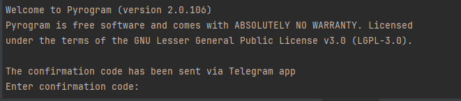
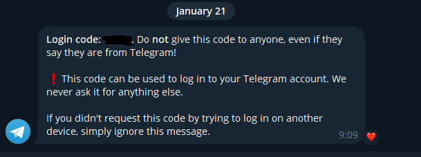

# XTTR Telegram client

Проект позволяет получить группы и каналы пользователя в телеграме и их краткую историю

## Содержание
- Технологии
- Начало работы
- TODO
- Команда


## Технологии
- Python 3.12
- [Pyrogram](https://docs.pyrogram.org/)
- [Rich](https://rich.readthedocs.io/en/stable/introduction.html)

## Начало работы
Для началы работы необходимо запустить файл main.py, который находится в папке app.
При первом запуске потребуется авторизация в телеграмме.
Для этого в env файле нужно указать:
- ID пользователя
- Номер телефона

При запуске будет отправлено сообщение в телеграм с кодом для подтверждения входа:




После нуэно внести пароль, при наличие двухфакторной аунтентификации.
После подключения будут созданы файлы сессии, с помощью которых при повторном запуске авторизация не понадобится

В меню приложения доступен выбор получения групп и каналов пользователя:
```commandline
Do you want to get groups or channels [groups/channels]:
```

После выбора будет представлена таблица с сооветствующим выбором

Пользователь может получить краткую историю канала или группы при вводе id, который указан в таблице

## TODO
Необходимо реализовать функцию для суммирования текста диалога

## Команда
 - Иван хрипунов
